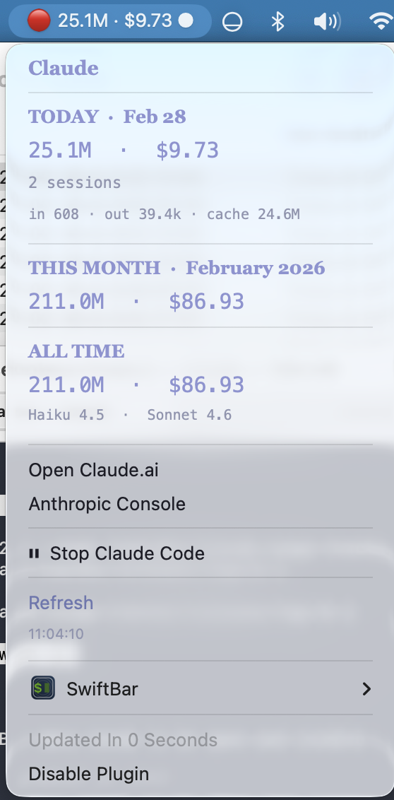

# Claude Usage Tracker

A [SwiftBar](https://swiftbar.app) plugin for macOS that shows your Claude Code token usage and estimated costs directly in the menu bar — updated every 5 minutes, no API key required.

  



---

## Features

- **Today / This Week / This Month / All Time** token counts and estimated costs
- **Yesterday delta** — ▲/▼ spend comparison vs the previous day
- **Cache savings** — shows how much you saved via cache hits, plus cache hit %
- **Per-model breakdown** — Haiku, Sonnet, Opus all tracked separately
- **Input, output, and cache** token detail per session
- **Color-coded menubar icon** — green / yellow / red based on daily usage
- **Stop Claude Code button** — detects running Claude processes and kills them instantly from the menu
- **Running indicator** — `●` appended to the menubar label when Claude Code is active
- **Daily and monthly budget caps** — set `DAILY_BUDGET` or `MONTHLY_BUDGET` to get a progress bar and ⚠️ alert when exceeded
- **Projected monthly cost** — estimated end-of-month spend based on your daily average
- **Works offline** — reads directly from `~/.claude/projects/` JSONL files
- **No API key needed** — 100% local

---

## Installation

### One-command install

```bash
git clone https://github.com/knowjoby/claude-usage-tracker.git
cd claude-usage-tracker
bash install.sh
```

The installer will:
1. Check for Python 3 and SwiftBar
2. Find your SwiftBar plugins folder automatically
3. Create a symlink so future updates apply instantly

### Manual install

1. Install [SwiftBar](https://swiftbar.app) and move it to `/Applications`
2. Clone or download this repo
3. Symlink the plugin into your SwiftBar plugins folder:
   ```bash
   ln -s /path/to/claude-usage-tracker/claude-usage.5m.py ~/Documents/SwiftBar-Plugins/
   ```
4. Refresh SwiftBar

> **Tip:** Install SwiftBar in `/Applications` (not Downloads) to ensure full feature support including light/dark mode color switching.

---

## Requirements

- macOS 12+
- Python 3.8+
- [SwiftBar](https://swiftbar.app) 2.0+ (free, available on the Mac App Store)
- [Claude Code](https://claude.ai/code) — must have been run at least once to generate session files

---

## Configuration

Set environment variables in SwiftBar or at the top of the script:

| Variable | Default | Description |
|---|---|---|
| `SHOW_COST` | `true` | Show estimated USD cost |
| `PLAN` | `pro` | `pro` or `api` (reserved for future use) |
| `DAILY_BUDGET` | `0` | Daily spend cap in USD — `0` disables. Shows a progress bar and ⚠️ alert when exceeded |
| `MONTHLY_BUDGET` | `0` | Monthly spend cap in USD — `0` disables. Shows a progress bar and ⚠️ alert when exceeded |

To edit via SwiftBar: right-click the menu bar icon → **SwiftBar** → **Edit Plugin**.

---

## Pricing

Cost estimates use Anthropic's published pricing per million tokens:

| Model | Input | Output | Cache write | Cache read |
|---|---|---|---|---|
| Opus 4.x | $15.00 | $75.00 | $18.75 | $1.50 |
| Sonnet 4.x | $3.00 | $15.00 | $3.75 | $0.30 |
| Haiku 4.5 | $0.80 | $4.00 | $1.00 | $0.08 |

Update prices in the `PRICES` dict at the top of `claude-usage.5m.py` if Anthropic changes them.

---

## How it works

Claude Code saves session data as JSONL files in `~/.claude/projects/`. This plugin reads those files at startup and on a 5-minute refresh cycle, parses `assistant` message entries, extracts token usage, and calculates costs — all locally, with no network calls.

---

## Running Tests

The test suite covers all core logic — token formatting, cost calculation, session parsing, and edge cases.

```bash
python3 test_claude_usage.py
```

Expected output:
```
Ran 32 tests in 0.009s

OK
```

---

## Changelog

See [CHANGELOG.md](CHANGELOG.md) for version history.

---

## License

MIT
